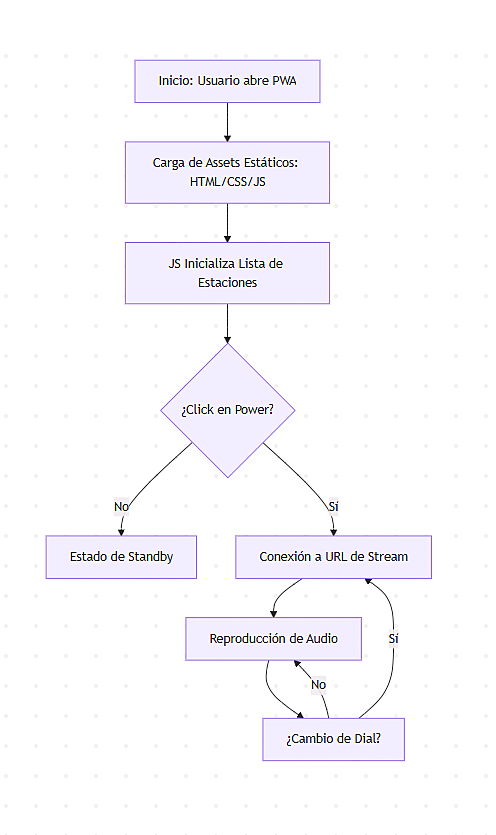
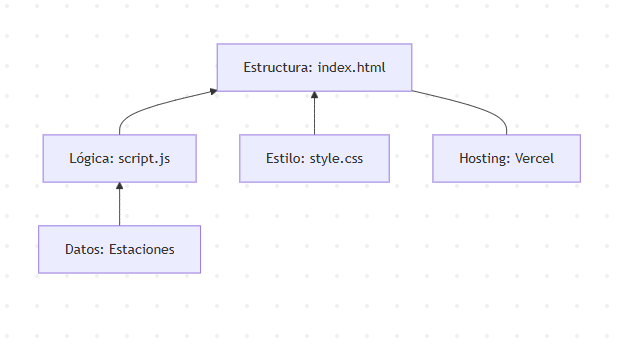
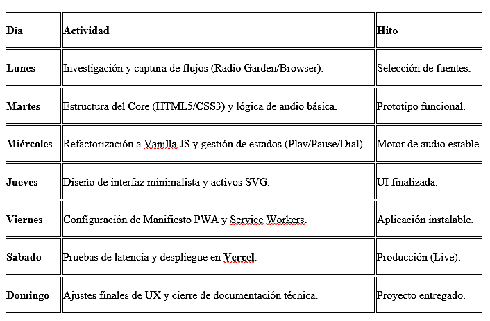

# Informe de Ingeniería: Radio Online Minimalista

Streaming de música clásica y ambiental para concentración y estudio. PWA de alto rendimiento desarrollada en html5, css y Vanilla JS con optimización de recursos.

## Índice
I. Introducción  
II. Identificación del Problema  
III. Objetivos del Proyecto  
&nbsp;&nbsp;&nbsp;&nbsp;&nbsp;&nbsp;Objetivo General  
&nbsp;&nbsp;&nbsp;&nbsp;&nbsp;&nbsp;Objetivos Específicos  
IV. Características del Negocio  
V. Requerimientos del Proyecto  
&nbsp;&nbsp;&nbsp;&nbsp;&nbsp;&nbsp;Metodología (Scrum)  
&nbsp;&nbsp;&nbsp;&nbsp;&nbsp;&nbsp;Historias de Usuario  
&nbsp;&nbsp;&nbsp;&nbsp;&nbsp;&nbsp;Requerimientos funcionales y no funcionales  
VI. Diseño de la Solución  
&nbsp;&nbsp;&nbsp;&nbsp;&nbsp;&nbsp;BPMN  
&nbsp;&nbsp;&nbsp;&nbsp;&nbsp;&nbsp;Casos de uso  
&nbsp;&nbsp;&nbsp;&nbsp;&nbsp;&nbsp;Componentes  
&nbsp;&nbsp;&nbsp;&nbsp;&nbsp;&nbsp;Modelo de datos  
VII. Planificación del Proyecto  
&nbsp;&nbsp;&nbsp;&nbsp;&nbsp;&nbsp;Cronograma  
&nbsp;&nbsp;&nbsp;&nbsp;&nbsp;&nbsp;Product Backlog  
VIII. Desarrollo  
* Especificación de Arquitectura  
* Descripción de las tecnologías  
* Integración de las tecnologías  
* Implementación de la solución  
* Aplicación de métodos, estándares y buenas prácticas  
* Ajuste del Cronograma  
IX. Conclusiones  
X. Marco Teórico y fuentes bibliográficas  
XI. Referencias Bibliográficas

---

## I. Introducción
El presente informe documenta el desarrollo de una Progressive Web App (PWA) de streaming de audio, diseñada bajo el paradigma de la Ingeniería de Invisibilidad. La aplicación tiene como propósito fundamental ofrecer canales de música clásica, sacra y ambiental, optimizados para flujos de trabajo que requieren alta concentración y desconexión sensorial. A diferencia de las plataformas convencionales, este software se rige por el principio de mínimos recursos y máxima eficiencia, eliminando cualquier componente estético o lógico que no cumpla una función crítica demostrable. La simplicidad de su interfaz oculta una ingeniería basada en Vanilla JavaScript, garantizando que la tecnología se funda con la experiencia del usuario de manera silenciosa.

## II. Identificación del Problema
En el ecosistema digital actual, las interfaces de streaming suelen estar saturadas de algoritmos de recomendación invasivos, publicidad visual y un consumo excesivo de memoria RAM debido al uso de frameworks pesados. Esta "deuda técnica" y visual genera una distracción constante que afecta al usuario. Los problemas detectados son:
* **Distracción Cognitiva:** Las interfaces convencionales impiden que el usuario mantenga el enfoque y la concentración necesarios para flujos de trabajo profundo.
* **Degradación del Rendimiento:** El uso excesivo de bibliotecas de terceros y elementos innecesarios satura el hardware en dispositivos de gama media o baja.
* **Barreras de Acceso:** La dificultad para encontrar entornos sonoros puros (música docta y sacra) sin interrupciones, anuncios o sobrecarga de información innecesaria.

## III. Objetivos del Proyecto
### Objetivo General
Desarrollar una infraestructura de software robusta y minimalista mediante una Progressive Web App (PWA), que proporcione un entorno sonoro de alta concentración. El sistema debe operar bajo el paradigma de la Optimización, garantizando una experiencia de usuario fluida y un consumo mínimo de recursos, facilitando su despliegue y ejecución en la plataforma Vercel.
### Objetivos Específicos
* **Eficiencia de Hardware:** Eliminar el uso de frameworks pesados y dependencias de terceros, utilizando exclusivamente HTML5, CSS3 y Vanilla JavaScript para asegurar la ligereza absoluta del sistema.
* **Arquitectura Cloud-Native:** Implementar una solución preparada para Vercel, aprovechando su infraestructura para garantizar disponibilidad global, seguridad SSL nativa y tiempos de carga instantáneos.
* **Ergonomía Funcional:** Diseñar una interfaz limpia que suprima elementos distractores (logins, anuncios, menús complejos), centrando únicamente en la reproducción de audio de alta fidelidad.
* **Estabilidad de Streaming:** Integrar flujos de audio especializados en música clásica, docta y sacra, validados por su continuidad técnica y calidad de emisión.

## IV. Características del Negocio
El proyecto se define como un activo digital de acceso abierto y gratuito, diseñado para potenciar el rendimiento cognitivo sin barreras económicas. Sus características principales son:
* **Finalidad Social:** Herramienta de uso libre orientada al apoyo de estudiantes y profesionales que requieren estados de alta concentración y estudio profundo.
* **Modelo sin Fricción:** Al ser gratuito y no requerir registro de usuario, se elimina cualquier barrera de entrada, priorizando la utilidad inmediata.
* **Ausencia de Monetización Invasiva:** El software está libre de publicidad y sistemas de rastreo, garantizando un entorno de trabajo limpio y privado.
* **Bajo Costo Operativo:** Gracias a su arquitectura técnica simplificada y al despliegue en la capa gratuita de Vercel, el mantenimiento del sistema es de costo prácticamente cero.

## V. Requerimientos del Proyecto
### Metodología (Scrum)
Se aplicó un Scrum de ciclo único (Sprint de 7 días), priorizando la agilidad y la entrega de un producto funcional inmediato.
* **Planificación:** Se definieron las estaciones base mediante la captura de flujos vía Network Inspect en plataformas como Radio Garden y Radio-Browser.
* **Ejecución:** Desarrollo diario enfocado en la estabilidad del motor de audio y la compatibilidad PWA.
* **Revisión:** Pruebas en tiempo real sobre Vercel para asegurar latencia mínima.

### Historias de Usuario
* **Como estudiante**, quiero una interfaz sin distracciones para activar música sacra/clásica con un solo click y entrar en estado de flujo.
* **Como profesional**, necesito que la app consuma el mínimo de RAM para no ralentizar mis herramientas de trabajo principales.
* **Como usuario móvil**, deseo instalar la radio como una app nativa (PWA) para acceder rápidamente desde mi pantalla de inicio.

### Requerimientos Funcionales (RF)
* **RF1 - Extracción de Flujos:** El sistema debe conectar con URLs de streaming externas obtenidas mediante ingeniería inversa y APIs abiertas (Radio-Browser).
* **RF2 - Control de Audio:** Reproducción, pausa y navegación entre estaciones mediante un dial de frecuencias.
* **RF3 - Persistencia PWA:** Uso de un Manifest para permitir la instalación en dispositivos iOS/Android/Desktop.

### Requerimientos No Funcionales (RNF)
* **RNF1 - Simplicidad de Código:** Desarrollo basado exclusivamente en Vanilla Stack (HTML, CSS, JS) sin compiladores.
* **RNF2 - Velocidad de Carga:** El sitio debe estar operativo en menos de 3 segundo tras el despliegue en Vercel.
* **RNF3 - Disponibilidad:** Funcionamiento garantizado 24/7 mediante infraestructura Cloud-Native.

## VI. Diseño de la Solución
En este capítulo se detalla la arquitectura lógica y funcional del sistema, orientada a la Optimización absoluta de los recursos y la eficiencia del despliegue en la nube.

### 1. BPMN (Diagrama de Procesos)
Describe el flujo de trabajo del software desde que se carga la interfaz hasta la emisión del sonido. Es un proceso lineal que minimiza los puntos de decisión para acelerar la ejecución.

### 2. Casos de Uso
Define las interacciones esenciales entre el usuario y la radio. Se reduce a tres acciones críticas para mantener el enfoque en la tarea principal (estudio/trabajo).
* Sintonización: Navegación por el array de emisoras.
* Gestión de Energía: Activación/Desactivación del motor de audio.
* Instalación: Anclaje del contenedor al dispositivo (PWA).

### 3. Componentes
Representa la estructura de archivos y cómo interactúan. Al no usar frameworks, la arquitectura es de acoplamiento simple:
* Capa de Presentación: HTML5 y CSS3 (Diseño Vectorial).
* Capa de Lógica: Vanilla JavaScript (Motor de la aplicación).
* Capa de Datos: Objeto JSON interno (URLs de Radio Garden/Radio-Browser).

### 4. Modelo de Datos
Dada la naturaleza del proyecto, no existe una base de datos relacional externa. El modelo reside en una estructura de datos constante dentro del código, lo que garantiza velocidad de lectura cero.

## VII. Planificación del Proyecto
La planificación se centró en un Time-boxing de 7 días, donde la velocidad de ejecución fue priorizada sobre la burocracia documental, permitiendo pasar de la idea al despliegue en tiempo récord.

### 1. Cronograma (Sprint de 7 días)
El desarrollo se dividió en hitos diarios para asegurar la integración continua en Vercel.

### 2. Product Backlog
Organizado por prioridad crítica para mantener la simplicidad del sistema:
1. [Prioridad Alta] Implementar motor de audio compatible con protocolos HLS/Streaming.
2. [Prioridad Alta] Crear el array de datos con las estaciones curadas de música clásica y sacra.
3. [Prioridad Media] Desarrollar la lógica de navegación circular (dial de frecuencias).
4. [Prioridad Media] Configurar el despliegue (CI/CD) mediante el repositorio de GitHub hacia Vercel.
5. [Prioridad Baja] Optimización de carga inicial mediante la eliminación de redundancias en el CSS.

## VIII. Desarrollo
### 1. Especificación de Arquitectura
Se ha implementado una arquitectura de Cliente Delgado (Thin Client) sobre una estructura de archivos planos. El flujo de datos es unidireccional:
* Origen: Servidores de streaming externos (obtenidos mediante ingeniería inversa).
* Procesamiento: Lógica en el cliente (navegador) mediante JavaScript.
* Despliegue: Edge Network de Vercel para minimizar la latencia de carga inicial.

### 2. Descripción de las Tecnologías
Para cumplir con el objetivo de Optimización, se seleccionaron tecnologías de estándar abierto:
* **HTML5:** Uso semántico para accesibilidad y manejo del motor de audio nativo.
* **CSS3 (Flexbox/Grid):** Para una interfaz responsiva y ligera sin librerías como Bootstrap.
* **Vanilla JavaScript:** Manipulación del DOM y gestión de eventos de audio.
* **Web Manifest & Service Workers:** Componentes clave para convertir el sitio en una PWA.
* **Vercel:** Plataforma de despliegue con integración continua.

### 3. Integración de las Tecnologías
La integración se realiza mediante un archivo script.js que actúa como orquestador. Este archivo consume el objeto de datos (obtenido mediante la inspección del tráfico de red en Radio-Browser) e inyecta dinámicamente las URLs en el atributo src del elemento `<audio>`.

### 4. Implementación de la Solución
Construcción basada en el Vanilla Stack, con maquetación de un solo contenedor y botones SVG integrados para evitar peticiones HTTP extra.

### 5. Aplicación de métodos, estándares y buenas prácticas
* **DRY (Don't Repeat Yourself):** Centralización de la lógica para evitar duplicaciones.
* **Performance First:** Uso exclusivo de SVG y texto para máxima velocidad.
* **Seguridad:** Despliegue seguro mediante HTTPS en Vercel.

### 6. Ajuste del Cronograma
Aunque se planificó para 7 días, la Optimización del código permitió tener un prototipo funcional al día 3. El tiempo restante se reinvirtió en mejorar la compatibilidad PWA para Android.

## IX. Conclusiones
Se demostró que es posible construir una herramienta de alto rendimiento en solo una semana con Vanilla Stack. La simplicidad de la arquitectura permite cumplir el objetivo de ser una herramienta de apoyo al estudio sin distracciones.

## X. Marco Teórico y fuentes bibliográficas
El sustento técnico se basa en estándares modernos: PWA, Arquitectura Serverless en Vercel, protocolos de streaming HTTP y diseño vectorial puro.

## XI. Referencias Bibliográficas
* W3C (2026). HTML5 Audio Specification.
* Google Developers. Progressive Web Apps Documentation.
* Radio-Browser API. https://www.radio-browser.info/
* Radio Garden. https://radio.garden/
* Vercel Documentation. Deployment and CI/CD.
